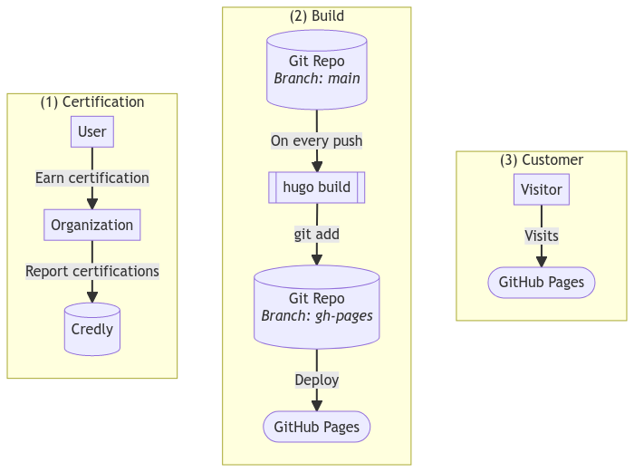
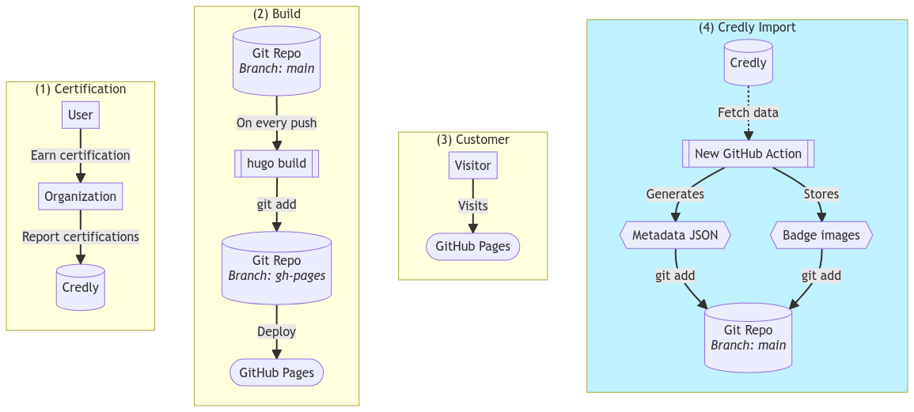

+++
date = "2022-10-19"
title = "Scraping Credly with GitHub Actions"
tags = ["GitHub Actions", "Credly", "Microsoft"]
aliases = [
    "/en/blog/2022/10-github-actions-and-credly/",
    "/en/blog/2022/10/19/scraping-credly-with-github-actions/"
]
categories = ["Development"]
+++

Have you ever heared about the certification sharing platform [Credly]? <!--more--> It's a very simple site, with a simple interface that solves a very simple issue: *Collecting and showing of certifications in a reliably and trusted way*.

What does this mean? It simply means that [Credly] maintains the connection with all the organizations that issue certifications (like [Microsoft], [GitHub] and many more). With this you could easily visit [my person][] at [Credly] and see all certifications that I earned. Additionally you could verify the badge I claim and all those informations are available in a well defined JSON format.

## 💡 Idea for automation

Cool! But why do I tell you this?

Simply because I wanted to list and/or show off all my certificates on this blog without having to sync them manually all the time (because ... well ... I'm a lazy developer 🤣).

## ⚙️ Architecture

So with this clear problem at hand, let me show you a short overview about all the loose parts at hand:



So looking at the diagram above we can conclude that we have three loosly coupled tasks / workflows / silos:

- **(1) Certifications**
    - A user (like me) earns certifications at an organization (like [Microsoft])
    - Once earned, the certification gets pushed to [Credly]
- **(2) Website**
    - This blog is built with [Hugo] and stored [on GitHub][1]
    - Every push to the `main` branch will trigger an [GitHub Action][2], that in turn runs `hugo build` and publishes the build results to a dedicated `gh-pages` branch
    - [GitHub Pages][] detects every change within `gh-pages` and publishes it to the "GitHub Cloud"
- **(3) Customer**
    - My DNS (hosted at [Gandi] btw.) points to the "GitHub Cloud"
    - Users (or their browsers) will fetch the final website from the "GitHub Cloud"

This is all fine and also allows us to pretty easily extend in all dimensions. My idea here is to introduce a new loosly coupled [GitHub Actions][] workflow that, on a regular basis, fetches all my certificates from [Credly] and stores the information in Git. With this in place, any change on [Credly] would be reflected within our Git repository (and in turn trigger a re-build and publish automatically). Pretty nice, isn't it?

So the final desired state diagram would look something like this:



As you can see above we changed **nothing** on the existing workflows / interactions. We simply added a whole new workflow that will import the [Credly][] files into our [own repository][1]. And, by design, any change to our repository will trigger a re-build and re-deploy of our website. :sign_of_the_horns:

## 🚀 Implementation

But how do we implement such a step? My solution consists of two parts that play together nicely.

## 1️⃣ Collecting data with [Credly2Hugo]

This new GitHub Action collects all the required informations from [Credly]. It's rather easy to use as most parameters are optional, and all you have to do is:

```yaml
# Add this step in one of your GitHub Workflow files
- uses: michaelcontento/credly2hugo-action@v1
  with:
    # The user of whom we want to grab the infos
    name: michael-contento
```

This will in turn create the following files:
- `data/CredlyBadges.json` with a [Hugo] optimized metadata JSON
- `data/CredlyBadgesRaw.json` with a raw metadata JSON from [Credly]
- `assets/images/CredlyBadges/*` where all individual badge images are stored

With this we have all informations from [Credly] successfully imported into our own Git repository and we can start using them as we like.

> Have a look [at the workflow file][3] of this blog for a full example.
>
>  [3]: https://github.com/michaelcontento/michaelcontento.github.io/blob/main/.github/workflows/credly.yml

If you want to know how the [Credly2Hugo] works, simply look at the source code. It's nothing special and just some `curl` for data retrieval and `jq` to create the [Hugo] optimized metadata JSON file.

## 2️⃣ Using it in [Hugo]

So now we have all informations stored in our repository - nice!
But how do we access them? Thanks to [Hugo Data Templates] this is as easy as:

```go
// Iterate over our hugo optimized metadata file
{{ range first 3 .Site.Data.CredlyBadges }}
    // give the current record a name for readability in the following 
    {{ $credly := . }}
    // let Hugo grab the image and resize it
    {{ $image := (resources.Get .LocalImagePath).Resize "150x150" }}
    // and simply render our bage as plain html image
    
{{ end }}
```

Which will result in:



## 🏁 Conclusion

We have rendered our badges dynamically on our page, **without** having to manually import them every time we earn a new badge and **without** having to use some kind of dynamic client side javascript.

Everything is pure Hugo Server Side Rendering 😎

And everything is automated in code as [GitHub Actions], everything is stored in Git and, a very small but nice goodie, we get a "badge earning history" for free as well 🤣

  [Credly]: https://www.credly.com
  [Microsoft]: https://www.microsoft.com
  [GitHub]: https://github.com
  [GitHub Actions]: https://github.com/features/actions
  [GitHub Pages]: https://pages.github.com/
  [Hugo]: https://gohugo.io/
  [Gandi]: https://www.gandi.net/en
  [Hugo Data Templates]: https://gohugo.io/templates/data-templates/
  [Credly2Hugo]: https://github.com/michaelcontento/credly2hugo-action
  [my person]: https://www.credly.com/users/michael-contento
  [1]: https://github.com/michaelcontento/michaelcontento.github.io
  [2]: https://github.com/michaelcontento/michaelcontento.github.io/blob/main/.github/workflows/gh-pages.yml
