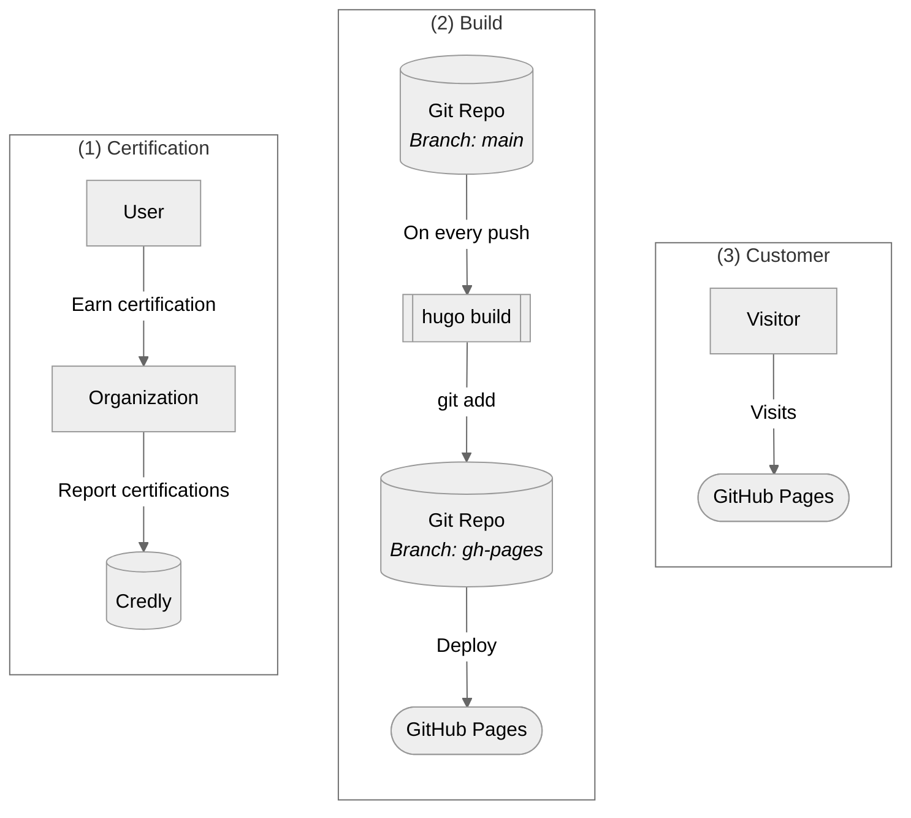
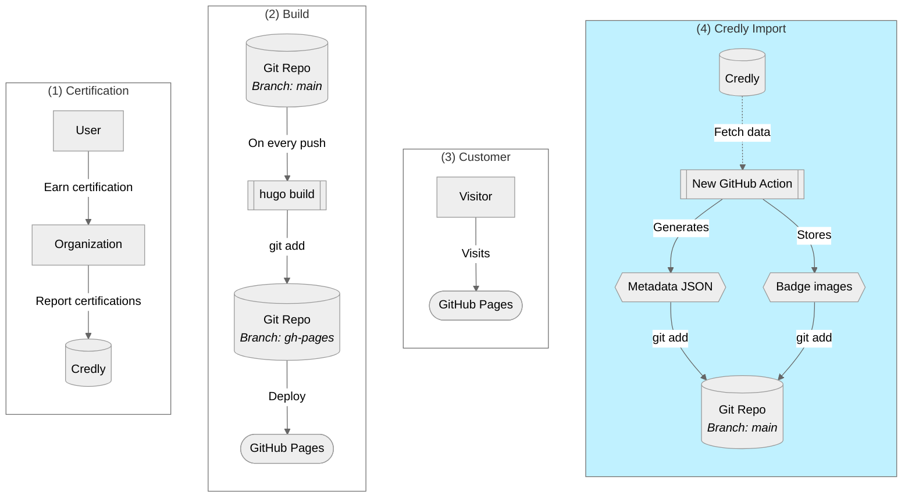

### :trophy: Credly ... wer?

Hast du schon einmal von der Zertifizierungsplattform [Credly] gehört? Es ist eine Website die ein sehr einfaches Problem löst: *Erfassen und Anzeigen von Zertifizierungen auf zuverlässige und vertrauenswürdige Weise*.

Was bedeutet das? Es bedeutet einfach, dass [Credly] als zentrales Bindeglied zwischen allen Organisationen fungiert, die Zertifizierungen ausstellen (wie [Microsoft], [GitHub] und viele mehr). Damit kann man sehr einfach z.B. [meine Person][] bei [Credly] besuchen und alle meine Zertifizierungen anschauen. Darüber hinaus kann man die Zertifizierungen noch verifizieren und - jetzt kommt das spannende - all diese Informationen sind in einem definierten JSON-Format verfügbar.

### :light_bulb: Idee zur Automatisierung

Cool! Aber warum erzähle ich das?

Einfach weil ich alle meine Zertifikate auf diesem Blog auflisten und/oder zeigen wollte, ohne sie ständig manuell synchronisieren zu müssen (weil ... naja ... ich bin ein fauler Entwickler :joy:).

### :gear: Architektur

Mit der Idee an der Hand schauen wir uns erst einmal die aktuelle Systemlandschaft von diesem Blog an:



Wenn wir uns also das obige Diagramm ansehen, dann erkennen wir drei lose gekoppelte Aufgaben / Workflows / Silos:

- **(1) Zertifizierungen**
    - Ein Benutzer (wie ich) erwirbt Zertifizierungen bei einer Organisation (wie [Microsoft])
    - Einmal erworben, wird die Zertifizierung an [Credly] gepusht
- **(2) Website**
    - Dieser Blog wird mit [Hugo] erstellt und [auf GitHub][1] gehostet
    - Jeder Push auf den `main` Branch löst eine [GitHub-Action][2] aus, die wiederum `hugo build` ausführt und die Build-Ergebnisse in einem dedizierten `gh-pages` Branch veröffentlicht
    - [GitHub Pages][] erkennt jede Änderung innerhalb von `gh-pages` und veröffentlicht sie in der "GitHub Cloud"
- **(3) Endkunden**
    - Mein DNS (gehostet bei [Gandi] übrigens) zeigt auf die "GitHub Cloud"
    - Benutzer (genauer: ihr Browser) bezieht die endgültige Website aus der "GitHub Cloud"

Das ist alles in Ordnung und ermöglicht es uns auch, ziemlich einfach in alle Dimensionen zu erweitern. Meine Idee ist einen neuen, lose gekoppelten, [GitHub Actions][]-Workflow einzuführen, der regelmäßig alle meine Zertifikate von [Credly] abruft und die Informationen in Git speichert. Damit würde jede Änderung auf [Credly] in unserem Git-Repository widergespiegelt werden, was wiederum den existierenden `hugo build`-Workflow startet. Ziemlich nett, nicht wahr?

Das endgültige gewünschte Zustandsdiagramm würde also so ​​aussehen:



Wie man oben sehen kann, haben wir **nichts** an den bestehenden Workflows / Interaktionen geändert. Wir haben einfach einen ganz neuen Workflow hinzugefügt, der die [Credly][]-Dateien in unser [eigenes Repository][1] importiert. Und jede Änderung an unserem Repository löst konstruktionsbedingt ein `hugo build` der Website aus. :sign_of_the_horns:

## :rocket: Implementierung

Aber wie implementieren wir das Ganze? Meine Lösung besteht aus zwei Teilen die, meiner Meinung nach, gut zusammenspielen.

### :one: Daten einsammeln mit [Credly2Hugo]

Diese neue GitHub Action sammelt alle Informationen von [Credly]. Sie ist sehr einfach zu verwenden, da die meisten Parameter optional sind und daher reicht meist:

```yaml
# Add this step in on of you GitHub Workflow files
- uses: michaelcontento/credly2hugo-action@v1
  with:
    # The user of whom we want to grab the infos
    name: michael-contento
```

Das ganze erzeugt nun folgende Dateien:
- `data/CredlyBadges.json`, eine [Hugo] optimierte metadata JSON Datei
- `data/CredlyBadgesRaw.json`, enthält das komplette metadata JSON von [Credly]
- `assets/images/CredlyBadges/*`, hier werden die Bilder aller Zertifikate gespeichert

Damit haben wir alle Informationen von [Credly] erfolgreich in unser eigenes Git-Repository importiert und können sie nach Belieben verwenden.

> **Hinweis**
> Schau einfach [in die Workflow-Datei][3] von diesem Blog für einen kompletten Workflow

Wenn du wissen willst wie [Credly2Hugo] funktioniert, dann schau einfach den Code auf GitHub. Es ist nichts besonderes, nur etwas `curl` für den Datenabruf und `jq`, um die [Hugo]-optimierte Metadaten-JSON-Datei zu erstellen.

### :two: In [Hugo] verwenden

Jetzt haben wir also alle Informationen in unserem Repository gespeichert - nice!
Aber wie greifen wir auf sie zu? Dank [Hugo Data Templates] ist das so einfach wie:

```go
// Iterate over our hugo optimized metadata file
{{ range .Site.Data.CredlyBadges }}
    // give the current record a name for readability in the following 
    {{ $credly := . }}
    // let Hugo grab the image and resize it
    {{ $image := (resources.Get .LocalImagePath).Resize "150x150" }}
    // and simply render our bage as plain html image
    
{{ end }}
```

Was dann so aussieht:



#### :tada: Tada! :tada:

### :chequered_flag: Faziy

Wir haben unsere Abzeichen dynamisch auf unserer Seite gerendert, **ohne** sie jedes Mal manuell importieren zu müssen sobald wir ein neues Zertifikat bekommen und **ohne** dynamisches clientseitiges Javascript verwenden zu müssen.

Alles ist reines Hugo Server Side Rendering :sonnenbrille:

Und alles ist in Code als [GitHub Actions] automatisiert, alles wird in Git gespeichert und als ganz kleines Goodie bekommen wir auch noch eine "Zertifikatshistory" gratis dazu :joy:

  [Credly]: https://www.credly.com
  [Microsoft]: https://www.microsoft.com
  [GitHub]: https://github.com
  [GitHub Actions]: https://github.com/features/actions
  [GitHub Pages]: https://pages.github.com/
  [Hugo]: https://gohugo.io/
  [Gandi]: https://www.gandi.net/en
  [Hugo Data Templates]: https://gohugo.io/templates/data-templates/
  [Credly2Hugo]: https://github.com/michaelcontento/credly2hugo-action
  [meine person]: https://www.credly.com/users/michael-contento
  [1]: https://github.com/michaelcontento/michaelcontento.github.io
  [2]: https://github.com/michaelcontento/michaelcontento.github.io/blob/main/.github/workflows/gh-pages.yml
  [3]: https://github.com/michaelcontento/michaelcontento.github.io/blob/main/.github/workflows/credly.yml